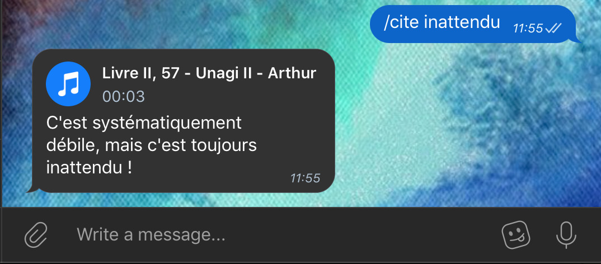
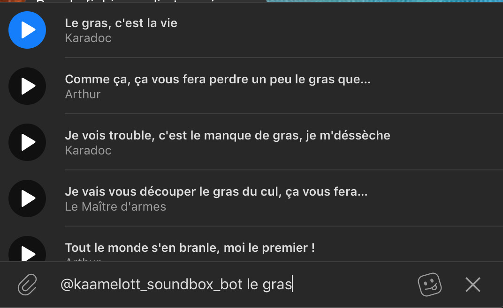

# Kaamelott Soundboard Telegram Bot

Les soundboard c'est trop bien et Kaamelott aussi alors pouvoir en avoir une dans Telegram, mon logiciel de messagerie préféré, c'est le pied !

Je tiens à remercier [2ec0b](https://github.com/2ec0b4) et sa superbe soundbox [kaamelott-soundbox](https://github.com/2ec0b4/kaamelott-soundboard) sans quoi rien n'aurais été possible puisque c'est de son projet que je sort la base de données de sons.

Si vous ne voulez pas héberger votre propre bot, le miens est disponible ici [https://t.me/kaamelott_soundbox_bot](https://t.me/kaamelott_soundbox_bot).

## Utilisation

Vous pouvez demander une citation au bot avec la commande `/cite texte`, il vous répondra ce qu'il trouve de mieux ou vous dira qu'il n'a pas trouvé. Il recherche avec le nom des personnages, de la citation et même de l’épisode.



Vous pouvez aussi l'utiliser à la manière du bot de gif en faisant `@nom_du_bot recherche` et il vous répondra plusieurs choix, à vous de choisir !



## Lancer le projet

Le fonctionnement est très simple, tout ce dont vous avez besoin c'est d'une version de go qui supporte les go modules. Moi j'ai utilisé la 1.14 et ça fonctionne bien.

```bash
git clone https://github.com/klmp200/kaamelott-soundboard-telegram-bot
cd kaamelott-soundboard-telegram-bot
go build
./kaamelott-soundboard-telegram-bot
```

Et voilà, c'est tout ! Tout est dans le même binaire ! Attention cependant, ça ne fonctionne que si on lance l'exécutable dans le même dossier que le dossier de musiques qui est fourni avec. Aussi, il se peut que Telegram vous refuse comme un malpropre parce que vous n'avez pas de clef d'API pour votre bot. Pour gérer ça c'est très simple, allez vous fabriquer un bot sur le botfather et mettez votre clef dans le fichier de settigs que vous créerez vous même sous le nom `settings.json`.

Voici à quoi il doit ressembler :

```json
{
    "telegram_key": "Ma superbe clef secrète",
    "domain": "mondomaine.git.an",
    "listening_address": "ladresseoùjecoutelesrequêteshttp:port"
}
```

Pourquoi une histoire de domaine alors que c'est un bot telegram ? En fait c'est très simple, pour faire des requêtes `inline` (à la manière du bot de gif), on ne peut donner que des liens vers la ressource à envoyer alors il faut absolument un serveur web où mettre les fichiers audio à disposition pour Telegram, c'est ce que fait l'application. C'est normal si cette fonctionnalité ne fonctionne pas quand vous exécutez le bot en local sans nom de domaine.

## Installer avec Docker

Si vous avez besoin d'une version conteneurisé de l'application, j'en ai réalisé une moi même à partir du fichier Dockerfile mis à disposition. Vous pouvez la récupérer ici [klmp200/kaamelott](https://hub.docker.com/r/klmp200/kaamelott).

Amusez vous bien !
